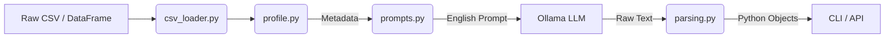

# Tyme Project: Lecture Notes & Architecture Guide

## 1. Project Overview

**What is Tyme?**
Tyme is a hybrid tool (CLI + Python Library) designed to assist data scientists. It bridges the gap between **Structured Data** (CSVs, DataFrames) and **Large Language Models** (LLMs).

**The Core Problem:**
LLMs are great at reasoning, but you cannot copy-paste a 100MB CSV file into ChatGPT. It's too big (context window limits) and privacy is a concern.

**The Solution:**
Tyme solves this by:
1.  **Profiling** the data locally (calculating stats, types, distributions).
2.  **Summarizing** this metadata into a concise text description.
3.  **Prompting** a local LLM (Ollama) to act as a "Senior Data Scientist".
4.  **Parsing** the LLM's text response back into structured objects (Suggestions).

---

## 2. High-Level Architecture

The data flows through the system in a linear pipeline:

---

## 3. File-by-File Explanation

Here is a breakdown of every module in the `tyme` package.

### 🏛️ Interface Layer (The "Front Office")

#### 1. `tyme/cli.py` (Command Line Interface)
*   **Role**: The entry point when you run `python -m tyme.cli`.
*   **Key Responsibilities**:
    *   Parses command line arguments (`argparse`).
    *   Coordinates the workflow: Load -> Profile -> Suggest -> Chat.
    *   Handles the specific user interactions like the `export` command string parsing.
    *   Manages the "Chat Loop" (`while True` loop) where you talk to the Assistant.

#### 2. `tyme/api.py` (Library API)
*   **Role**: The bridge for Python scripts/notebooks.
*   **Key Responsibilities**:
    *   Exposes clean functions like `get_suggestions()`.
    *   Hides the complexity of prompts and parsing from the user.
    *   Allows other developers to build apps *on top* of Tyme.

### 🧠 Logic Layer (The "Brain")

#### 3. `tyme/profile.py` (The Statistician)
*   **Role**: compress massive data into small metadata.
*   **How it works**:
    *   Iterates through columns.
    *   Checks types (Is it numeric? Date? Text?).
    *   Calculates stats (Mean, Min, Max, Missing %).
    *   Samples values (e.g., "Top 5 categories are A, B, C...").
*   **Why important**: This is the *only* information the LLM actually sees about your data.

#### 4. `tyme/prompts.py` (The Translator)
*   **Role**: Converts the raw profile dictionary into a human-readable English prompt.
*   **Key Concept**: "Context Construction". It tells the LLM:
    *   "You are a data scientist." (Persona)
    *   "Here is the data: Column A is numeric..." (Context)
    *   "Do not use column 'id_student'." (Constraints/Exclusions)
    *   "Return your answer in JSON format." (Formatting)

#### 5. `tyme/parsing.py` (The Interpreter)
*   **Role**: Converts the LLM's messy text output into strict Python objects.
*   **Key Responsibilities**:
    *   Extracts the JSON array from the text.
    *   Validates it matches our expected schema (Name, Why, How, Risk).
    *   Handles errors gracefully (if the LLM hallucinates bad JSON).

### 🔌 Connector Layer (The "Back Office")

#### 6. `tyme/ollama_client.py`
*   **Role**: The dumb pipe to the AI model.
*   **Action**: Sends the string prompt to `localhost:11434` (Ollama) and returns the string response.

#### 7. `tyme/csv_loader.py`
*   **Role**: Robust file reading.
*   **Why complex?**: CSVs are messy. Some use commas `,`, some semicolons `;`. This file tries multiple settings to ensure it loads correctly (our "sniffer" logic).

#### 8. `tyme/session.py`
*   **Role**: Simple data class to hold the state.
*   **Purpose**: Keeps track of `history` (chat logs), `profile`, and `suggestions` so the Chat mode remembers what you are talking about.
